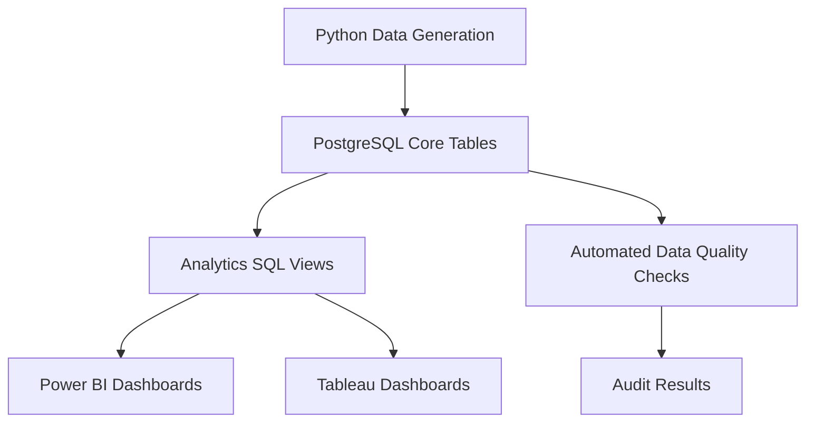
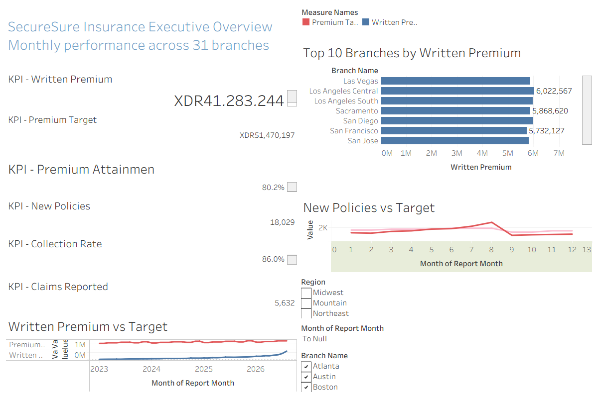
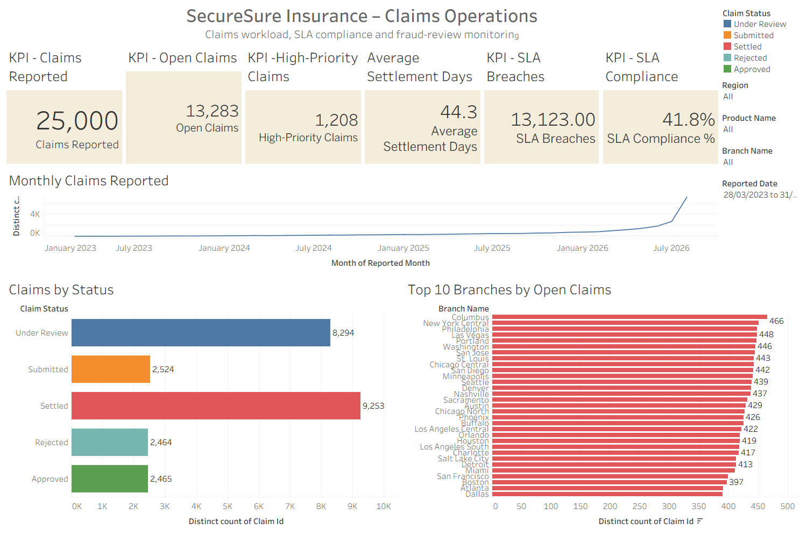

# SecureSure Insurance Analytics Platform

An end-to-end insurance analytics project that simulates how a data team builds, secures, tests, analyzes and presents company data using PostgreSQL, Python, Power BI and Tableau.

The project uses completely synthetic data and does not contain real customer or company information.

## Project Overview

SecureSure is an insurance company operating through 31 branches.

Management needs a centralized analytics platform to answer questions such as:

- Are branches meeting premium and new-policy targets?
- Which products generate the most written premium?
- What percentage of premiums have been collected?
- Which branches have the largest open-claims workload?
- How quickly are claims being settled?
- Which claims require fraud review?
- Are operational teams meeting claims-service targets?

The platform simulates the work performed by data analysts, BI analysts, analytics engineers and database professionals inside an insurance company.

## Technology Stack

| Technology | Purpose |
|---|---|
| PostgreSQL | Operational and analytical database |
| SQL | Schemas, tables, constraints, indexes and reporting views |
| Python | Synthetic-data generation and automated quality checks |
| Power BI | Executive, product and claims dashboards |
| Tableau | Executive and claims operations dashboards |
| Git and GitHub | Version control and project documentation |
| PowerShell | Running database scripts and pipeline commands |

## Solution Architecture



The workflow separates operational data from reporting logic:

1. Python generates fictional insurance records.
2. PostgreSQL stores validated relational data.
3. SQL views prepare business-ready datasets.
4. A restricted reporting account provides read-only access.
5. Power BI and Tableau connect to the analytics layer.
6. Python quality checks record pipeline results in the audit schema.

## Database Design

The database uses four schemas:

| Schema | Purpose |
|---|---|
| `raw` | Landing area for future source-system data |
| `core` | Validated operational insurance tables |
| `analytics` | Reporting views consumed by BI tools |
| `audit` | Pipeline runs and data-quality results |

### Core Tables

- `core.branches`
- `core.agents`
- `core.customers`
- `core.products`
- `core.policies`
- `core.payments`
- `core.claims`
- `core.branch_targets`

### Analytics Views

- `analytics.branch_monthly_performance`
- `analytics.product_monthly_performance`
- `analytics.claims_operations`

### Audit Objects

- `audit.pipeline_runs`
- `audit.data_quality_results`
- `audit.latest_data_quality_results`

## Data Volume

The synthetic dataset contains approximately:

| Dataset | Records |
|---|---:|
| Branches | 31 |
| Products | 10 |
| Agents | 155 |
| Customers | 50,000 |
| Policies | 80,000 |
| Payments | 320,000 |
| Claims | 25,000 |
| Branch monthly targets | 1,364 |

These records are generated programmatically and are not copied from an actual insurance company.

## Business Metrics

The dashboards track metrics including:

- Written premium
- Premium target attainment
- New policies
- Policy target attainment
- Premium collection rate
- Average product premium
- Claims reported
- Open claims
- High-priority claims
- SLA breaches
- SLA compliance
- Average settlement days
- Overdue and failed payments
- Auto-renew enrollment

## Power BI Dashboards

### Executive Overview


Provides management with branch-level premium, policy, collection and target-performance metrics.

### Claims Operations


Monitors claims volume, open workload, fraud-review indicators, settlement time and SLA compliance.

### Product Performance


Compares insurance products using written premium, new policies, average premium, collections and overdue payments.

The Power BI model uses dimension tables, one-to-many relationships, a dedicated date table and reusable DAX measures.

## Tableau Dashboards

### Executive Overview



Presents written premium, targets, new policies, collection performance, monthly trends and branch rankings.

### Claims Operations



Provides an interactive view of claim volumes, statuses, open claims by branch, fraud-review workload and service-level performance.

## Data Quality

The Python quality-check pipeline tests areas such as:

- Missing primary identifiers
- Duplicate customer, policy and claim numbers
- Invalid policy date ranges
- Negative financial amounts
- Payments linked to nonexistent policies
- Claims linked to nonexistent policies
- Invalid settlement dates
- Payment amounts exceeding expected limits
- Referential integrity
- Required reporting data

Results are written to `audit.data_quality_results`, creating a history of quality-test executions.

Expected successful result:

```text
16/16 data quality checks passed
```

## Database Security

The project follows the principle of least privilege.

BI tools connect using a dedicated PostgreSQL role:

```text
dashboard_reader
```

This role can read approved objects in the `analytics` schema but cannot directly query sensitive core customer tables.

Passwords and connection secrets are stored locally in `.env` and are excluded from Git.

The analytics views also avoid exposing direct customer names, email addresses, phone numbers or street addresses.

## Project Structure

```text
SecureSure-Insurance-Analytics/
├── analysis/
├── data/
├── database/
│   ├── 01_create_schemas.sql
│   ├── 02_create_core_tables.sql
│   ├── 03_seed_reference_data.sql
│   ├── 04_update_payment_rules.sql
│   ├── 05_generate_branch_targets.sql
│   ├── 06_create_indexes.sql
│   ├── 07_create_branch_performance_view.sql
│   ├── 08_create_claims_operations_view.sql
│   ├── 09_create_product_performance_view.sql
│   ├── 10_create_data_quality_table.sql
│   └── 11_create_dashboard_role.sql
├── docs/
├── pipeline/
│   ├── db_connection.py
│   ├── generate_people.py
│   ├── generate_policies.py
│   ├── generate_payments.py
│   ├── generate_claims.py
│   └── run_data_quality_checks.py
├── power-bi/
│   ├── SecureSure_Insurance_Analytics.pbix
│   └── screenshots/
├── tableau/
│   ├── SecureSure_Insurance_Analytics.twbx
│   └── screenshots/
├── tests/
├── .env.example
├── .gitignore
├── README.md
└── requirements.txt
```

## Local Setup

### Requirements

Install:

- Python 3.12 or later
- PostgreSQL
- Git
- Power BI Desktop
- Tableau Desktop

### 1. Clone the repository

```powershell
git clone https://github.com/thestevejunior/SecureSure-Insurance-Analytics.git
cd SecureSure-Insurance-Analytics
```

Replace `YOUR-USERNAME` with the correct GitHub username.

### 2. Create the PostgreSQL database

```powershell
psql -U postgres
```

Inside PostgreSQL:

```sql
CREATE DATABASE securesure;
\q
```

### 3. Create the virtual environment

```powershell
python -m venv .venv
.venv\Scripts\Activate.ps1
pip install -r requirements.txt
```

### 4. Configure environment variables

Copy `.env.example` to `.env`:

```powershell
Copy-Item .env.example .env
```

Enter the local PostgreSQL credentials in `.env`.

Never commit `.env` to GitHub.

### 5. Build the database

Run the SQL scripts in numerical order:

```powershell
psql -U postgres -d securesure -f database/01_create_schemas.sql
psql -U postgres -d securesure -f database/02_create_core_tables.sql
psql -U postgres -d securesure -f database/03_seed_reference_data.sql
psql -U postgres -d securesure -f database/04_update_payment_rules.sql
```

### 6. Generate synthetic records

```powershell
python pipeline/generate_people.py
python pipeline/generate_policies.py
python pipeline/generate_payments.py
python pipeline/generate_claims.py
```

### 7. Create targets, indexes and analytics views

```powershell
psql -U postgres -d securesure -f database/05_generate_branch_targets.sql
psql -U postgres -d securesure -f database/06_create_indexes.sql
psql -U postgres -d securesure -f database/07_create_branch_performance_view.sql
psql -U postgres -d securesure -f database/08_create_claims_operations_view.sql
psql -U postgres -d securesure -f database/09_create_product_performance_view.sql
psql -U postgres -d securesure -f database/10_create_data_quality_table.sql
```

### 8. Run data-quality checks

```powershell
python pipeline/run_data_quality_checks.py
```

### 9. Create the reporting role

Run the security script as an administrator:

```powershell
psql -U postgres -d securesure -f database/11_create_dashboard_role.sql
```

Use a secure local password. Do not place that password in the SQL file or commit it to GitHub.

## BI Connection

For local development, Power BI and Tableau connect using:

| Setting | Value |
|---|---|
| Server | `localhost` |
| Port | `5432` |
| Database | `securesure` |
| User | `dashboard_reader` |
| Schema | `analytics` |

The password is intentionally excluded from this repository.

## Practical Company Simulation

This project reflects common company practices:

- Transactional information is stored in normalized relational tables.
- Analysts query curated reporting views rather than raw operational tables.
- BI users receive read-only database access.
- Sensitive fields are excluded from dashboards.
- Data quality is checked before reporting.
- Database changes are stored as numbered SQL scripts.
- Large generated datasets and secrets are excluded from source control.
- Business users consume interactive dashboards rather than raw database tables.

In a real organization, PostgreSQL could be hosted on a private company server or a managed cloud service such as Amazon RDS, Azure Database for PostgreSQL or Google Cloud SQL.

## Repository Safety

This repository does not include:

- Database passwords
- `.env`
- PostgreSQL server files
- Real customer information
- Production database backups
- Private connection strings

All visible business records are fictional and generated specifically for this portfolio project.

## Skills Demonstrated

- Relational database design
- Advanced SQL
- Data modeling
- Python pipeline development
- Data-quality automation
- Database security
- DAX
- Power BI dashboard development
- Tableau dashboard development
- Business KPI design
- Git version control
- Technical documentation

## Future Improvements

- Deploy PostgreSQL to a managed cloud database
- Schedule pipeline execution
- Add automated GitHub Actions tests
- Add incremental BI refresh
- Add pipeline failure notifications
- Add database migration tooling
- Create a public portfolio summary page

## Author

**Stephen Oduro**

Data Analyst | SQL | Python | Power BI | Tableau | PostgreSQL